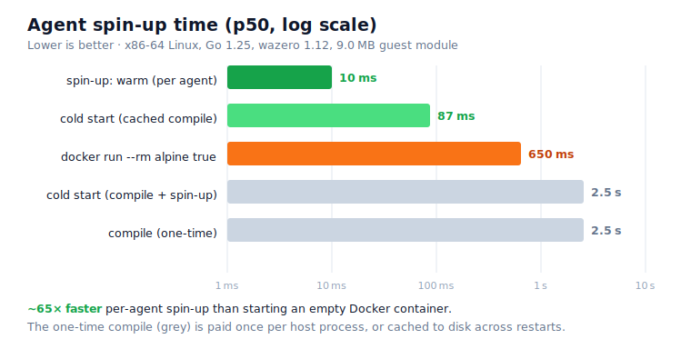

# Latigo — Durable Agent Harness

Latigo is an independent, embeddable agent harness written in Go and compiled to
WebAssembly (`wasip1`). It is **sandboxed by construction** (no direct network or
disk), **deterministic**, and **reconstructable from its event log** on any
conformant host.

The guest runs an agent loop with a virtual filesystem, a bash-like shell, on-
demand markdown skills, and sandboxed Starlark script tools. It reaches the
outside world only through a small, versioned ABI of host calls. Hosts implement
that ABI; this repo owns the contract.

## Repository layout

| Path | Artifact |
|------|----------|
| [`abi/`](abi) | ABI v0: the versioned host/guest contract as Go types |
| [`events/`](events) | Durable event schema and checkpoint format |
| [`guest/`](guest) | The in-guest harness: agent loop, VFS, virtual bash, skills, Starlark tools, tool registry |
| [`cmd/latigo-guest/`](cmd/latigo-guest) | `main` compiled to WASM |
| [`host/`](host) | Reference host library: dispatch, durability, replay, fs/llm/tools/exec/... handlers, wazero bridge |
| [`cmd/latigo-local/`](cmd/latigo-local) | Reference local host CLI (local FS, OpenAI-compatible/Mortise LLM, JSONL log) |
| [`cmd/latigo-bench/`](cmd/latigo-bench) | Spin-up benchmark harness (compile, warm/cold spin-up, Docker baseline) |
| [`conformance/`](conformance) | Host conformance suite |
| [`docs/`](docs) | [ABI spec](docs/ABI.md), [event schema](docs/EVENTS.md) |

## Quick start

```sh
# Build the guest to WebAssembly and the reference host.
make guest host

# Run with the built-in deterministic mock LLM (no network needed).
./latigo-local -wasm latigo.wasm "list the files under /work"

# Reconstruct the run from its durable event log — no re-execution.
./latigo-local -wasm latigo.wasm -replay

# Use a real OpenAI-compatible endpoint (or Mortise):
OPENAI_BASE_URL=https://api.openai.com/v1 OPENAI_API_KEY=sk-... \
  ./latigo-local -wasm latigo.wasm -model gpt-4o-mini "summarise README"

# Grant governed network access: curl / the http_fetch tool, allowlisted per host.
./latigo-local -wasm latigo.wasm -http -http-allow 'api.github.com,*.example.com' \
  "fetch https://api.github.com/zen and report it"
```

## Networking

The guest has **no ambient network access**. The only way out is the governed
`http.fetch` capability, which the host must explicitly grant and which it
mediates on every request: scheme/method/host allowlisting, SSRF defence
(private, loopback, and cloud-metadata addresses are blocked, with the resolved
IP pinned to defeat DNS rebinding), a response-size cap, and request-header
stripping. In the guest this surfaces as `curl`/`wget` in the virtual shell and
an `http_fetch` tool — both thin wrappers over the one governed hostcall, so the
*host* decides where requests may go, not the model. Because it is a hostcall,
every response is recorded and replay-safe.

`exec.run` (native process execution) is a separate, deny-by-default **ambient**
capability that escapes these guarantees, so the reference host keeps it from
becoming an ungoverned second egress: it requires an explicit command allowlist,
never inherits the host environment, and network-isolates the child unless you
opt into unsafe networked exec. Enabling it stamps the run as `ambient` in the
event log. See [docs/ABI.md](docs/ABI.md#trust-tiers-and-the-single-egress-rule).

Run everything (including a real wasm run + replay integration test):

```sh
make test
```

## Spin-up performance

Latigo is designed so a host compiles the guest module **once** and then spins up
many fresh, fully-isolated agents on demand. Because each agent is a new WASM
instance (its own linear memory, VFS, and shell) rather than a new OS container,
spin-up is measured in **milliseconds, not hundreds of milliseconds**.



Benchmark it yourself:

```sh
make bench            # compile + warm/cold spin-up
make bench DOCKER=1   # also run the `docker run` baseline for comparison
```

Representative numbers on one x86-64 Linux dev machine (Go 1.25, wazero 1.12,
9.0 MB guest module; p50 over 300/20 iterations):

| Phase | What it measures | p50 |
|-------|------------------|-----|
| compile (one-time) | Compile the guest WASM to native code; done once per host process | ~2.5 s |
| **spin-up: warm (per agent)** | **Instantiate a fresh, isolated sandbox from the hot module and boot the guest to ready** | **~10 ms** |
| cold start (cached compile) | Fresh runtime + spin-up, reusing wazero's persisted compilation cache | ~87 ms |
| cold start (compile + spin-up) | Fully cold path including a from-scratch compile | ~2.5 s |
| `docker run --rm alpine true` | Start an empty container that does no work (baseline) | ~650 ms |

The compile cost is paid **once** — at process start, or amortized across
restarts via wazero's on-disk [compilation cache](https://pkg.go.dev/github.com/tetratelabs/wazero#NewCompilationCacheWithDir).
After that, each new agent boots in **~10 ms — roughly 65× faster than merely
starting an empty Docker container**, and the warm agent is already doing useful
work (capability negotiation + first turn) while the container has only just
reached its entrypoint. Absolute numbers vary by hardware; run `make bench` to
reproduce on yours.

## Design in one screen

- **Transport.** One imported function, `latigo_abi.hostcall`, carries length-
  prefixed JSON in the guest's linear memory. See [docs/ABI.md](docs/ABI.md).
- **Namespaces.** `fs.*`, `llm.call`, `tool.list`/`tool.invoke`, `exec.run`
  (optional), `msg.send`/`msg.recv`, `approval.await`, `log.append`, and host-
  injected `clock.now`/`rand.bytes`.
- **Capability negotiation** happens at instantiation; the guest degrades
  gracefully when an optional capability is absent.
- **Durability.** Write-ahead: every hostcall result is appended, flushed, and
  fsynced before the guest observes it. Events carry harness-version stamps.
  Periodic checkpoints enable compaction and bounded replay. **Replay is state
  reconstruction from recorded results — never re-execution.** See
  [docs/EVENTS.md](docs/EVENTS.md).
- **In-guest.** Agent loop with configurable strategy points (compaction,
  termination); virtual bash + VFS (`mvdan/sh` + `afero`); skills as on-demand
  markdown; Starlark script tools with step/output budgets; tool catalog
  received from the host.

## Requirements

Go 1.25+ (the wazero host runtime requires it; the toolchain is auto-selected via
`go.mod`).
